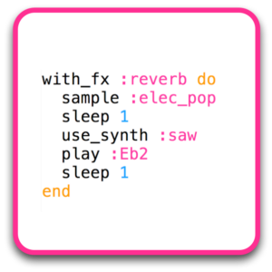

## Make beats and music through programming

New for 2023, we are running workshops using the fantastic, free music programming language [Sonic Pi](https://sonic-pi.net/) to create some cool beats on your computer.

First visit the website [https://sonic-pi.net/](https://sonic-pi.net/)to download Sonic Pi. Double-click the downloaded file to install it, then start the program up.

Now follow our [workshop slides](https://docs.google.com/presentation/d/1N8RG4ZbPPmX9y4qg9YKRXDPD6KUf0DtLvfeAvWQmA7M/edit?usp=sharing).

